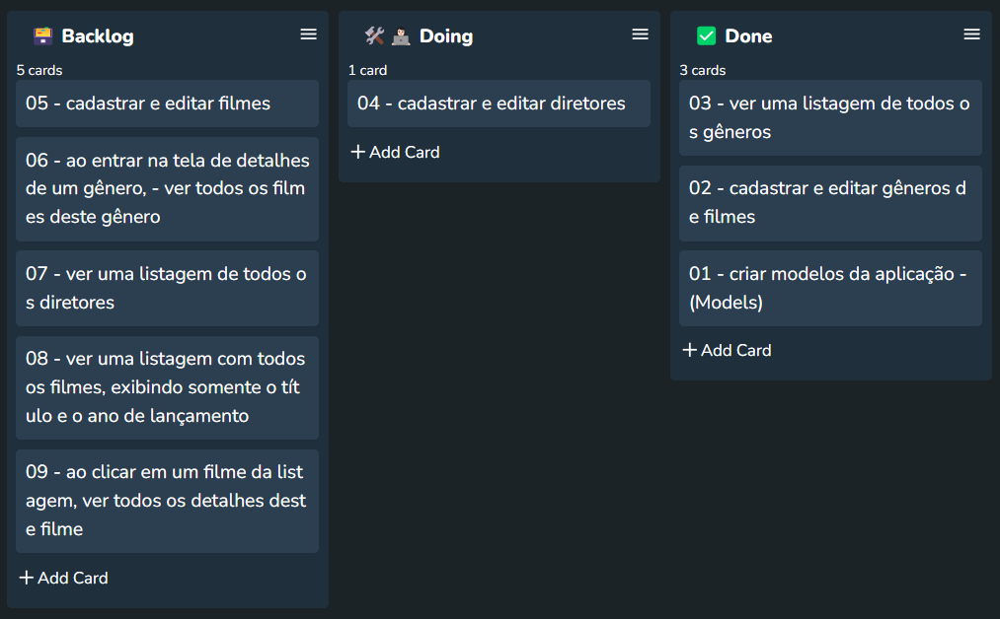

# CinetecaHub
> Aplicação de catálogo de filmes

This README would normally document whatever steps are necessary to get the
application up and running.

Things you may want to cover:

* Ruby version: Ruby 3.0.0
* Rails version: Rails 7.1.3.2 

* System dependencies

* Configuration

* Database creation

* Database initialization

* How to run the test suite

* Services (job queues, cache servers, search engines, etc.)

* Deployment instructions

* ...

## A documentação das tarefas do projeto, se encontram em: 
[CinetecaHub.kanban](https://github.com/EmmanuellaAlbuquerque/CinetecaHub/blob/main/.github/CinetecaHub.kanban)
* Foi utilizada a extensão **Portable Kanban** no VSCode 
  * harehare.portable-kanban

