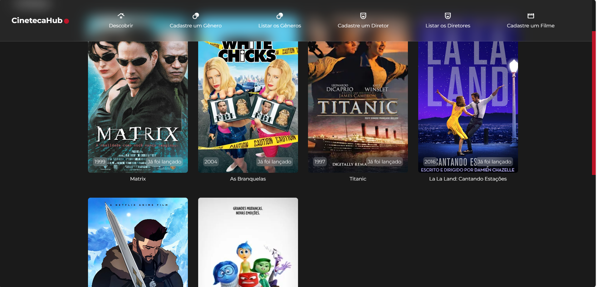
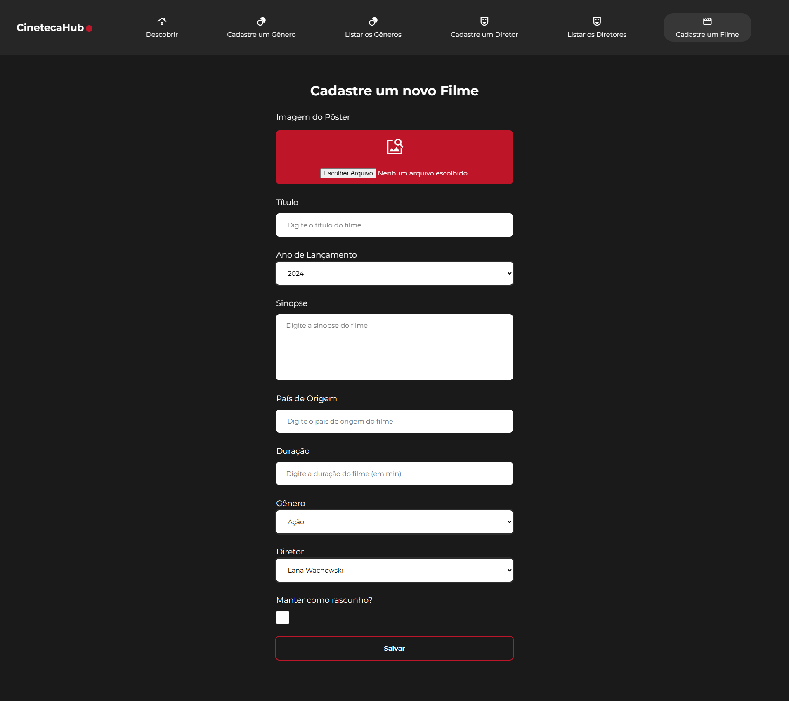
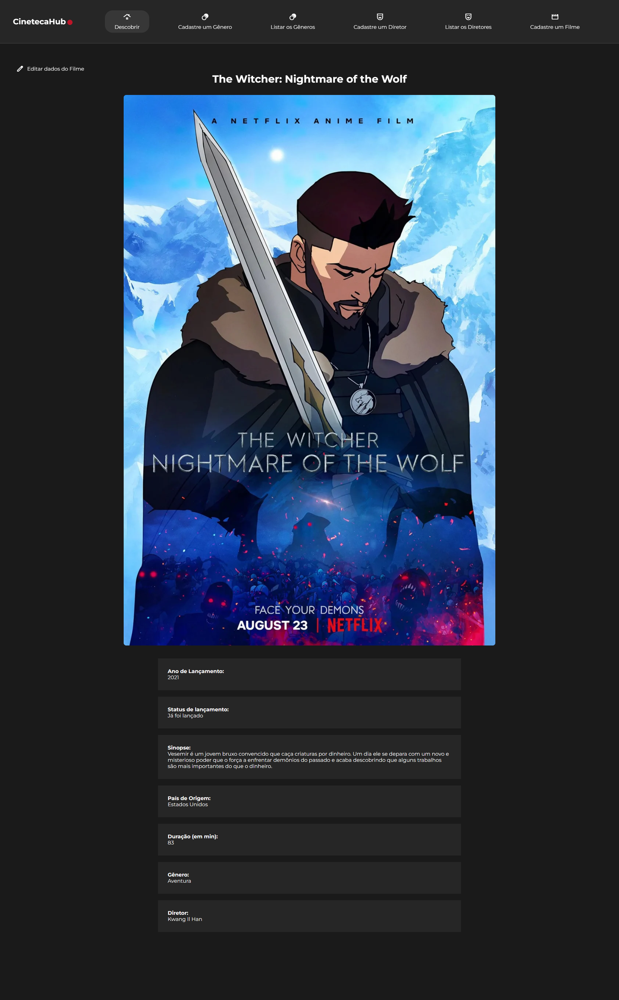
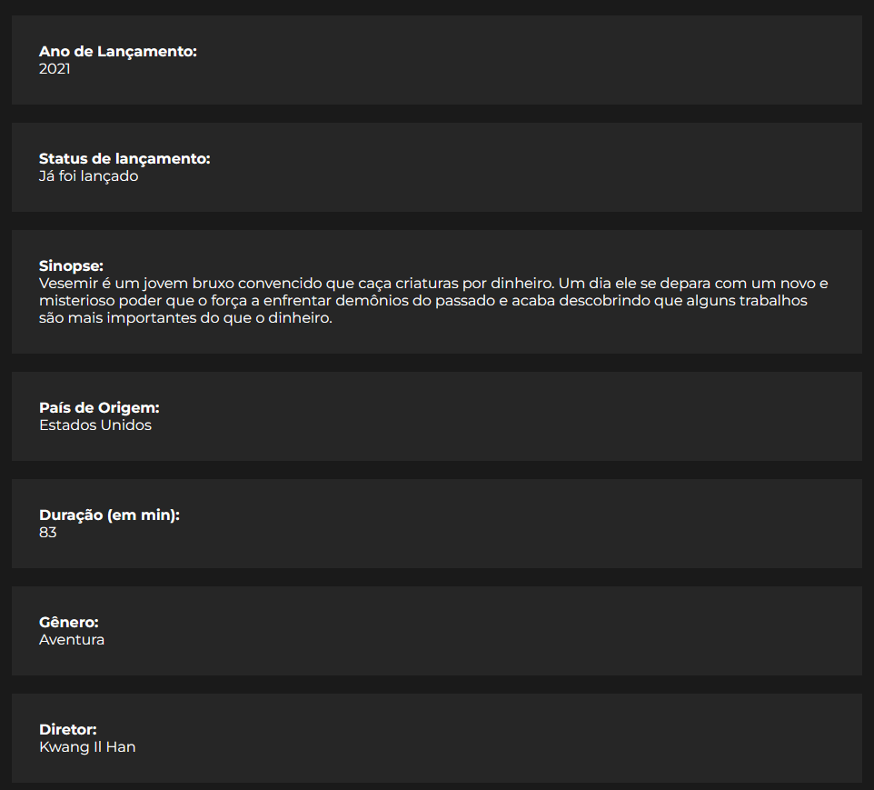
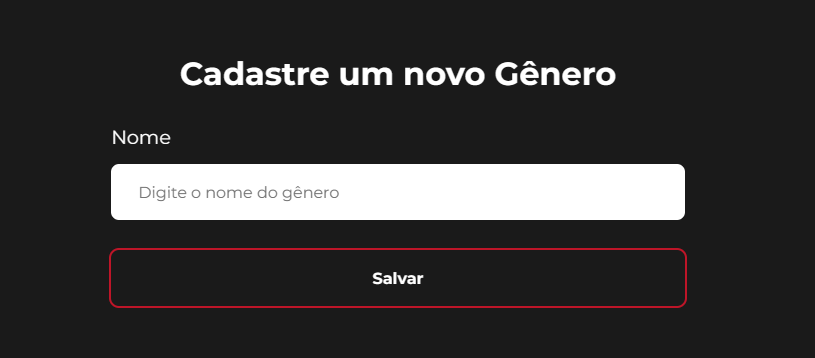
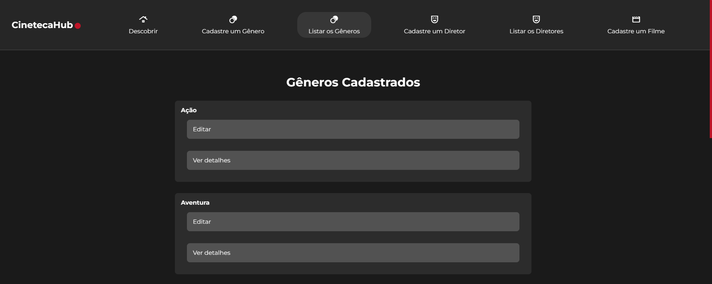
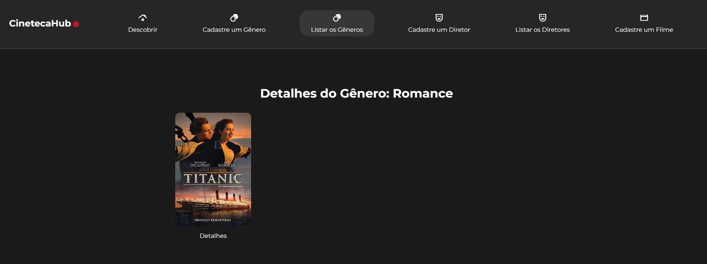
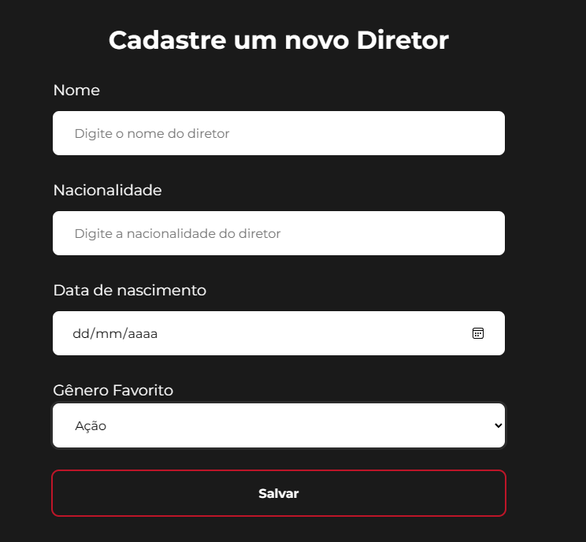
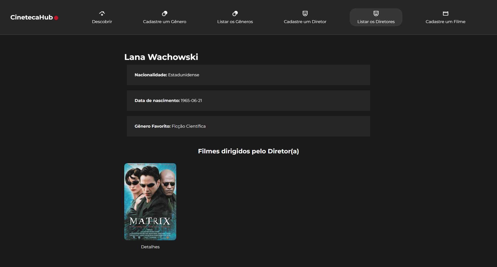
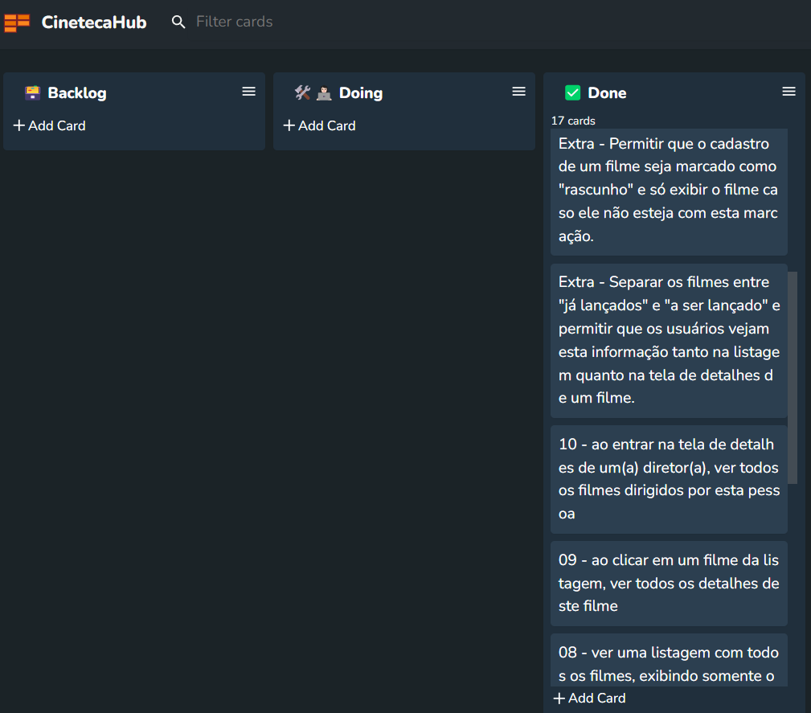

# CinetecaHub (Desafio Treina Dev)


https://github.com/EmmanuellaAlbuquerque/CinetecaHub/assets/57198678/e0555bbd-b084-47dc-81a5-0292803378e1

## Escopo do projeto (Aplicação de catálogo de filmes)

A aplicação deverá ser capaz de gerenciar cadastros de gêneros de filmes (como ação, romance, ficção científica, etc), diretores e filmes.

## :art: Telas

Página Inicial |
:---: |
 |

Cadastrando um novo Filme |
:---: |
 |

Detalhes de um Filme (Poster) |
:---: |
 |

Detalhes de um Filme (Dados) |
:---: |
 |

Cadastrando um novo Gênero |
:---: |
 |

Gêneros Cadastrados |
:---: |
 |

Detalhes de um Gênero  |
:---: |
 |

Cadastrando um novo Diretor  |
:---: |
 |

Detalhes de um Diretor |
:---: |
 |

## :globe_with_meridians: Rotas

### Filmes (Movies)

| Prefixo          | Verbo   | URI                            | Controlador#Método            |
|------------------|---------|--------------------------------|-------------------------------|
| publish_movie    | PATCH   | /movies/:id/publish(.:format)  | movies#publish                |
| movies           | GET     | /movies(.:format)              | movies#index                  |
|                  | POST    | /movies(.:format)              | movies#create                 |
| new_movie        | GET     | /movies/new(.:format)          | movies#new                    |
| edit_movie       | GET     | /movies/:id/edit(.:format)     | movies#edit                   |
| movie            | GET     | /movies/:id(.:format)          | movies#show                   |
|                  | PATCH   | /movies/:id(.:format)          | movies#update                 |
|                  | PUT     | /movies/:id(.:format)          | movies#update                 |
|                  | DELETE  | /movies/:id(.:format)          | movies#destroy                |

### Diretores (Directors)

| Prefixo          | Verbo   | URI                            | Controlador#Método            |
|------------------|---------|--------------------------------|-------------------------------|
| directors        | GET     | /directors(.:format)           | directors#index               |
|                  | POST    | /directors(.:format)           | directors#create              |
| new_director     | GET     | /directors/new(.:format)       | directors#new                 |
| edit_director    | GET     | /directors/:id/edit(.:format)  | directors#edit                |
| director         | GET     | /directors/:id(.:format)       | directors#show                |
|                  | PATCH   | /directors/:id(.:format)       | directors#update              |
|                  | PUT     | /directors/:id(.:format)       | directors#update              |
|                  | DELETE  | /directors/:id(.:format)       | directors#destroy             |

### Gêneros (Genres)

| Prefixo          | Verbo   | URI                            | Controlador#Método            |
|------------------|---------|--------------------------------|-------------------------------|
| genres           | GET     | /genres(.:format)              | genres#index                  |
|                  | POST    | /genres(.:format)              | genres#create                 |
| new_genre        | GET     | /genres/new(.:format)          | genres#new                    |
| edit_genre       | GET     | /genres/:id/edit(.:format)     | genres#edit                   |
| genre            | GET     | /genres/:id(.:format)          | genres#show                   |
|                  | PATCH   | /genres/:id(.:format)          | genres#update                 |
|                  | PUT     | /genres/:id(.:format)          | genres#update                 |
|                  | DELETE  | /genres/:id(.:format)          | genres#destroy                |

## Tecnologias utilizadas

* Ruby version 3.0.0
* Rails version 7.1.3.2 
* SASS: (.scss)

<p align="center">
   
</p>

## A documentação das tarefas do projeto, se encontram em: 
[CinetecaHub.kanban](https://github.com/EmmanuellaAlbuquerque/CinetecaHub/blob/main/.github/CinetecaHub.kanban)
* Foi utilizada a extensão **Portable Kanban** no VSCode 
  * harehare.portable-kanban



## Documentação da Criação do projeto em Ruby on Rails

[Documentacao.md](https://github.com/EmmanuellaAlbuquerque/CinetecaHub/blob/main/.github/docs/Documentacao.md)

```ruby
while alive
  eat()
  sleep()
  code()
  repeat()
end
```

<p style="text-align:center;">Made with ❤️ by Manu!</p>
